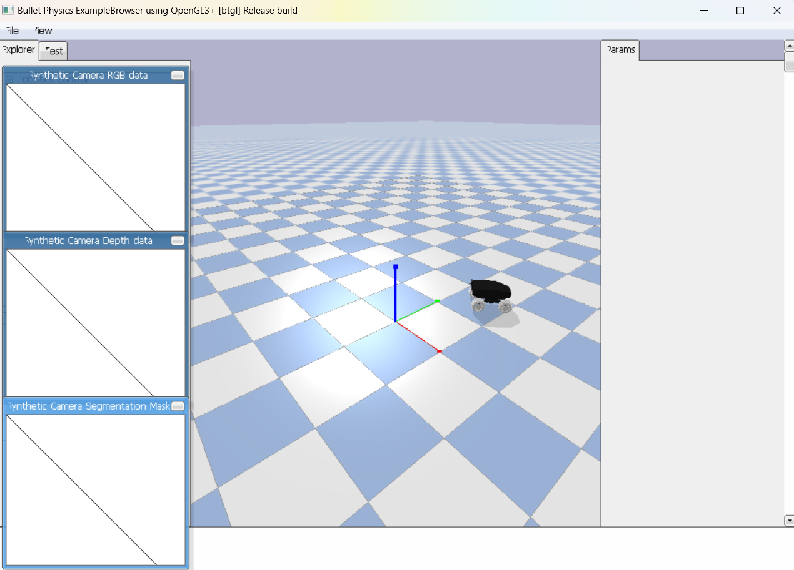

# EKF-MPC Robot Navigation

This project explores and implements two advanced methodologies—Extended Kalman Filter (EKF) and Model Predictive Control (MPC)—to enhance the localization and trajectory control capabilities of an autonomous wheeled mobile robot. Through the integration of EKF and MPC, this system provides precise position estimation and smooth trajectory tracking, even in the presence of sensor noise and environmental uncertainties.

<!--  -->

## Project Overview

The main goals of this project are:
1. **Localization**: Using EKF to estimate the robot's position and orientation based on range-bearing sensor measurements from known landmarks.
2. **Trajectory Control**: Implementing an MPC-based controller to track desired trajectories and maintain stability.
3. **Integration**: Combining EKF and MPC for robust trajectory tracking under noisy conditions.
4. **Performance Comparison**: Evaluating the system's accuracy and stability with and without EKF integration.

## Key Components

### Extended Kalman Filter (EKF)
The EKF estimates the robot's pose (position and orientation) by processing noisy sensor inputs. This approach effectively handles the nonlinear dynamics of the robot, adjusting for sensor noise and environmental uncertainties.

### Model Predictive Control (MPC)
MPC optimizes the robot's control inputs by predicting future states and minimizing a cost function over a finite prediction horizon. This ensures smooth and efficient trajectory tracking.

### EKF-MPC Integration
By integrating EKF's state estimates with MPC's control strategy, the system achieves enhanced navigation accuracy and robustness against noise, supporting reliable control in real-world scenarios.

## Project Structure

### Task 1: Implement an EKF-based Localization System
The first task focuses on developing a robust localization system using an Extended Kalman Filter (EKF). Localization is crucial for autonomous navigation, as it enables the robot to estimate its position and orientation within a known environment.

- **Develop the EKF Algorithm**: Implement an EKF algorithm that processes sensor data (range and bearing measurements) from known landmarks in the environment to estimate the robot’s current position and orientation.
- **Design State and Measurement Models**: Define models for the robot's motion and sensor measurements, which are essential for the EKF’s prediction and update steps.
- **Simulate and Test**: Run simulations to validate the EKF's ability to accurately track the robot’s position over time, particularly when navigating in complex environments.

### Task 2: Develop and Fine-tune an MPC Controller for Trajectory Tracking
The second task involves implementing a Model Predictive Control (MPC) controller to manage the robot’s movement along a specified trajectory. MPC is a control strategy that optimizes control inputs by predicting future states, enabling smooth and efficient navigation.

- **Set Up the MPC Framework**: Implement the MPC algorithm, defining the state-space matrices (A and B) that represent the system’s dynamics, as well as cost matrices (Q and R) to balance state accuracy and control smoothness.
- **Define Cost Function and Constraints**: Configure the MPC to minimize deviations from the target trajectory by adjusting control inputs (e.g., wheel velocities). The cost function considers state errors and control efforts, ensuring smooth trajectory following.
- **Parameter Tuning**: Adjust the MPC parameters, including the prediction horizon and weighting matrices (Q, R), to optimize performance. Testing will identify configurations that allow the robot to accurately track trajectories with minimal delay and oscillations.

### Task 3: Integrate EKF and MPC into a Unified Control System
In this task, the EKF and MPC are combined into a single, cohesive control system, enabling the robot to navigate accurately and respond effectively to noisy environments.

- **Integrate EKF with MPC**: Use EKF’s state estimates as inputs to the MPC controller, improving the accuracy and stability of the robot’s movement, especially under sensor noise.
- **Simulate Integrated System**: Test the integrated EKF-MPC system in various simulated scenarios, assessing its ability to handle dynamic changes and disturbances.
- **Optimize and Refine**: Evaluate the performance of the integrated system and make adjustments to both the EKF and MPC parameters for optimal navigation accuracy and efficiency.

### Task 4: Compare Robot Performance With and Without EKF Integration
The final task is to evaluate the effectiveness of the EKF-MPC integration by comparing its performance to an MPC-only system that relies on ground-truth data.

- **Define Evaluation Metrics**: Compare the systems using metrics like steady-state error, settling time, and overshoot in both position and orientation.
- **Run Controlled Tests**: Test both systems (MPC with and without EKF) from various starting points and observe their stability, accuracy, and response to noise.
- **Analyze Results**: Analyze the collected data to identify improvements in noise resilience, tracking accuracy, and settling time due to EKF integration, and summarize the findings in terms of practical implications for real-world applications.

## Setup and Dependencies

This project was developed using Python 3.11.x and requires the following libraries:
- **NumPy** (v1.26.4): Matrix operations and numerical calculations.
- **Matplotlib** (v3.9.1): Visualization of robot trajectories and error metrics.
- **Simulation_and_control** (v0.1): Custom Python package providing interfaces to the PyBullet simulator and Pinocchio library.
